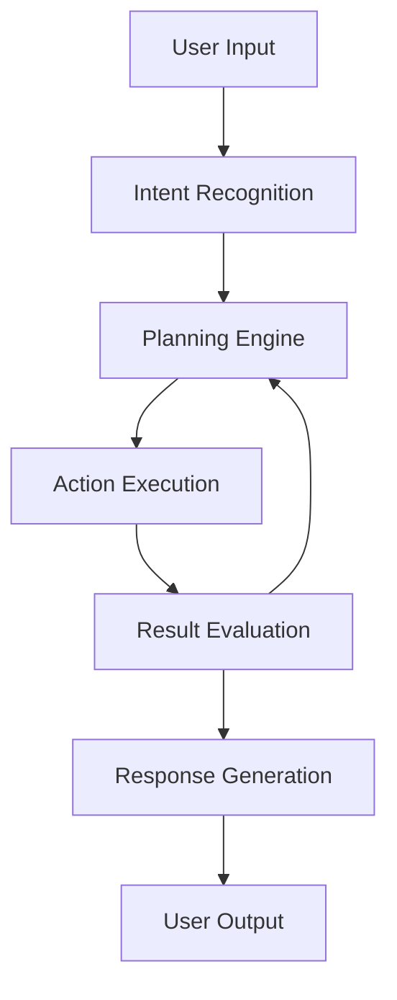

# Kingsley Obi | Agentic Engineer

  

## 👋 Welcome to my GitHub

I'm an **Agentic Engineer** specializing in building autonomous AI systems that solve real business problems. With expertise spanning **Full Stack Development**, **DevOps**, and **Software Engineering**, I create intelligent solutions that bridge technical innovation with measurable business outcomes.

  <a href="https://murfnet.com">Portfolio</a> •
  <a href="https://linkedin.com/in/mrkingsleyobi">LinkedIn</a> •
  <a href="mailto:murf@murfnet.com">Email</a>

---

## 🤖 About My Work with Agentic AI

I design and develop autonomous AI agents capable of understanding context, making decisions, and taking actions to solve complex business challenges. My approach combines cutting-edge AI technologies with robust software engineering practices to create systems that deliver tangible business value.

### Why Autonomous AI Agents?

Agentic AI systems fundamentally transform how businesses operate by enabling:

- **Automation of complex workflows** that previously required human judgment
- **Continuous operation** across time zones and without fatigue
- **Scalable intelligence** that can handle increasing workloads
- **Adaptive problem-solving** that improves with experience
- **Integration capabilities** that connect disparate systems

My work focuses on creating responsible, transparent AI agents that augment human capabilities rather than replace them, delivering measurable ROI while maintaining ethical standards.

---

## 🛠️ Technical Stack

<table>
  <tr>
    <td valign="top" width="33%">
      <h3>AI & Machine Learning</h3>
      <ul>
        <li>Large Language Models</li>
        <li>Multi-agent Systems</li>
        <li>Reinforcement Learning</li>
        <li>Natural Language Processing</li>
        <li>Computer Vision</li>
        <li>Python, TensorFlow, PyTorch</li>
        <li>LangChain, AutoGPT</li>
      </ul>
    </td>
    <td valign="top" width="33%">
      <h3>Full Stack Development</h3>
      <ul>
        <li>JavaScript/TypeScript</li>
        <li>React, Node.js</li>
        <li>Python, Django, Flask</li>
        <li>RESTful APIs, GraphQL</li>
        <li>SQL & NoSQL Databases</li>
        <li>Responsive Web Design</li>
        <li>Progressive Web Apps</li>
      </ul>
    </td>
    <td valign="top" width="33%">
      <h3>DevOps & Infrastructure</h3>
      <ul>
        <li>AWS, Azure, GCP</li>
        <li>Docker, Kubernetes</li>
        <li>CI/CD Pipelines</li>
        <li>Infrastructure as Code</li>
        <li>Monitoring & Logging</li>
        <li>Security Best Practices</li>
        <li>Scalable Architecture</li>
      </ul>
    </td>
  </tr>
</table>

---

## 🚀 Featured Projects

| Project | Description | Technologies | Links |
|---------|-------------|--------------|-------|
| **AgentFlow** | An autonomous workflow orchestration framework that integrates with enterprise systems to automate complex business processes | Python, LangChain, FastAPI, React, Docker | [Repo](https://github.com/mrkingsleyobi/agentflow) • [Demo](https://murfnet.com/ai-lab/agentflow) |
| **IntelliAssist** | Intelligent customer support agent that handles inquiries, troubleshoots issues, and escalates complex problems to human agents | Python, TensorFlow, NLP, React, Node.js | [Repo](https://github.com/mrkingsleyobi/intelliassist) • [Case Study](https://murfnet.com/projects/intelliassist) |
| **DevOpsAI** | AI-powered DevOps assistant that automates infrastructure management, identifies optimization opportunities, and enhances system reliability | Python, AWS, Terraform, Docker, Kubernetes | [Repo](https://github.com/mrkingsleyobi/devopsai) • [Article](https://murfnet.com/blog/ai-devops) |
| **DataSynthAI** | Synthetic data generation platform for training AI models while preserving privacy and addressing bias | Python, PyTorch, Pandas, NumPy, React | [Repo](https://github.com/mrkingsleyobi/datasynthai) |
| **EthicalAI Framework** | Open-source framework for implementing ethical considerations in AI agent development | Python, JavaScript, Documentation | [Repo](https://github.com/mrkingsleyobi/ethicalai) • [Docs](https://ethicalai.murfnet.com) |

  
<b>View More Projects</b>

  
  | Project | Description | Technologies | Links |
  |---------|-------------|--------------|-------|
  | **CloudOptimizer** | Cost optimization tool for cloud resources that identifies savings opportunities | Python, AWS SDK, Terraform, React | [Repo](https://github.com/mrkingsleyobi/cloudoptimizer) |
  | **SecureAPI** | API security framework with advanced authentication and threat detection | Node.js, Express, JWT, OAuth | [Repo](https://github.com/mrkingsleyobi/secureapi) |
  | **PerformancePro** | Web application performance monitoring and optimization toolkit | JavaScript, Web Vitals, Lighthouse | [Repo](https://github.com/mrkingsleyobi/performancepro) |
  | **MicroserviceKit** | Starter templates for building scalable microservice architectures | Docker, Kubernetes, gRPC, Node.js, Go | [Repo](https://github.com/mrkingsleyobi/microservicekit) |

---

## 📈 GitHub Stats

  

  

---

## 🔍 What I'm Currently Working On

- 🧠 Developing multi-agent systems that collaborate to solve complex business problems
- 🔄 Exploring the integration of reinforcement learning with large language models
- 🛡️ Implementing robust safety and alignment techniques for autonomous AI systems
- 📊 Creating visualization tools for AI agent decision-making processes
- 🌐 Building bridges between traditional software engineering and agentic AI

---

## 📝 Latest Blog Posts

<!-- BLOG-POST-LIST:START -->
- [Designing Effective Multi-Agent Systems for Business Applications](https://murfnet.com/blog/multi-agent-systems)
- [The Business Case for Agentic AI: ROI and Implementation Strategies](https://murfnet.com/blog/agentic-ai-roi)
- [Ethical Considerations in Autonomous Agent Development](https://murfnet.com/blog/ethical-ai-agents)
- [Bridging DevOps and AI: Automated Infrastructure Management](https://murfnet.com/blog/devops-ai-integration)
- [Full Stack Development in the Age of AI Agents](https://murfnet.com/blog/fullstack-ai-era)
<!-- BLOG-POST-LIST:END -->

---

## 🤝 Let's Connect

I'm always interested in challenging projects and collaborations, especially those involving:

- Autonomous AI agent development
- AI integration with existing business systems
- Ethical AI implementation
- Full stack applications with AI capabilities
- DevOps optimization through AI

Feel free to reach out if you're working on something interesting or have questions about my projects!

  
  
  
  

---

  

